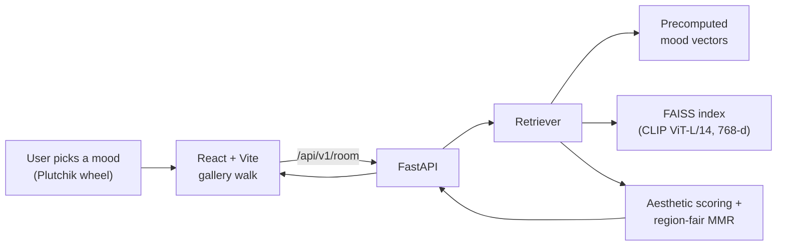

<h1 align="center">🎨 Anima</h1>
<p align="center"><em>A quiet gallery for how you feel.</em></p>

<p align="center">
  
  
  
  
  
</p>

Anima turns an emotion into a curated art exhibition. You pick how you feel on
**Plutchik's wheel of emotions** — and how strongly — and it opens a slow,
one-artwork-at-a-time **gallery walk** drawn from 1,600+ works spanning the world's
museums, Indian art traditions, and NASA's cosmos.

Under the hood it's a **vision-language retrieval system**: each artwork is
embedded with **CLIP ViT-L/14**, and a mood becomes a text query in that same
embedding space. Results are then re-ranked for **aesthetic quality** and
**cross-cultural fairness**, so every "room" feels like a museum — not a search.

---

## ✨ What it does

- **Mood → art.** An interactive 3D Plutchik wheel (8 emotions × 3 intensities)
  maps feeling to imagery.
- **A museum, not a search.** Results are curated for beauty and variety, shown
  one at a time with a wall label, artist, and source credit.
- **Genuinely global.** Round-robin balancing across world regions so a room isn't
  dominated by any single tradition.
- **Never the same twice.** Per-device session memory so you don't see repeats,
  with gentle variety between visits.
- **Contemplative by design.** Fits any screen with no scrolling; keyboard,
  touch-swipe, and screen-reader accessible.

<p align="center">
  
  
</p>

---

## 🧠 How the retrieval works

The interesting part isn't "search" — it's **curation**. Ranking blends three
signals instead of raw similarity:

1. **Mood match (CLIP).** Every image is a 768-d CLIP ViT-L/14 embedding. Each
   mood is a hand-tuned text prompt (e.g. *"a calm, gentle, harmonious artwork
   evoking safety and warmth"*) embedded into the same space; FAISS finds the
   closest works.
2. **Aesthetic quality.** A LAION aesthetic predictor scores each work — but the
   raw score is **normalized *within* each world region**, so the model's
   Western/photographic bias doesn't quietly demote folk art, miniatures, and
   sculpture.
3. **Region-aware diversity (MMR).** Maximal Marginal Relevance penalizes both
   visual redundancy *and* cultural monoculture, so a room spans traditions.

Two touches that make it feel human:
- **Therapeutic intent** — a distress selection (sadness, fear) is answered with
  regulating, uplifting imagery rather than more of the same.
- **Precomputed mood vectors** — the 24 fixed mood queries are embedded ahead of
  time, so the *serving* API needs no GPU, no PyTorch, no CLIP at runtime — just
  FAISS + NumPy. That's what lets the backend run on a free tier.



---

## 🛠️ Tech stack

| Layer | Tools |
|---|---|
| **ML / retrieval** | CLIP ViT-L/14 (`open_clip`), FAISS, LAION aesthetic predictor, NumPy |
| **Backend** | FastAPI, Uvicorn (lightweight serve: no torch/CLIP) |
| **Frontend** | React, TypeScript, Vite, Canvas particle system, SVG |
| **Data** | The Met, Cleveland Museum of Art, NASA Image Library, Indian art traditions |
| **Deploy** | Render (API), Hostinger (static frontend) |

---

## 🚀 Run it locally

**Prerequisites:** Python 3.11, Node 18+, and the built index in
`data/processed/index_world/`.

```bash
# 1. Backend (from the project root)
python -m venv .venv && source .venv/bin/activate
pip install -r requirements-serve.txt
uvicorn apps.api.main:app --port 8000

# 2. Frontend (in another terminal)
cd apps/web
npm install
npm run dev            # opens http://localhost:5173
```

The dev server proxies `/api` to the backend, so it works out of the box.

---

## 📁 Project structure

```
ml/                     data ingestion + CLIP/FAISS embedding + retrieval
  embeddings/
    retrieval.py        the curation engine (mood → ranked room)
    precompute_moods.py generates the fixed mood-query vectors
apps/
  api/                  FastAPI backend (serves curated rooms)
  web/                  React + Vite gallery-walk frontend
data/processed/         the built index (FAISS + metadata + embeddings)
```

---


## 🙏 Credits

Artwork courtesy of **The Metropolitan Museum of Art**, **The Cleveland Museum of
Art**, **NASA**, and various Indian art traditions — used under their open-access
programs, with source links shown on every piece in the gallery.

> Anima is a reflective art experience, **not** a substitute for professional
> mental-health care. If you're in crisis, please reach out to a local helpline.
